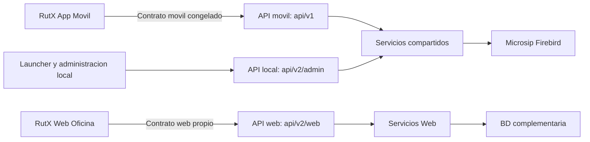

# Contrato y Nomenclatura — API exclusiva RutX Web v2

**Versión:** 1.2  
**Fecha:** 14 de agosto de 2026  
**Estado:** Contrato base aprobado para construcción progresiva.  
**Ámbito:** Módulo web de oficina/administración. No aplica a la app móvil ni al administrador local del Sincronizador.  
**Documentos relacionados:** [`Mapa_Documental_RutX_Web.md`](Mapa_Documental_RutX_Web.md) (jerarquía), [`guidelines.md`](guidelines.md) (consumo seguro desde Laravel), [`Plan_Estructura_Visual_Plataforma_Web_RutX.md`](Plan_Estructura_Visual_Plataforma_Web_RutX.md) (pantallas consumidoras) y [`Plan_Sprints_Semana_1.md`](Plan_Sprints_Semana_1.md) (orden de implementación).

---

## 1. Decisión de arquitectura

La plataforma web RutX consumirá un contrato de API **independiente del contrato móvil**. La separación no será únicamente visual ni documental: habrá controladores, DTOs, servicios de consulta, pruebas y rutas HTTP propios. Así, una modificación requerida por reportes, agenda, monitoreo, notificaciones o cancelaciones del personal de oficina no podrá romper la aplicación Flutter que usan los vendedores en la calle.

> **Decisión aprobable:** La raíz oficial para toda API de negocio exclusiva del módulo web será **`/api/v2/web`**. El prefijo comunica al mismo tiempo que se trata de la segunda familia de contratos del Sincronizador y que su consumidor es el portal administrativo, no la app móvil.

La estructura definitiva queda delimitada como sigue:

| Área | Prefijo HTTP | Consumidor | Estado contractual | Regla de seguridad |
|---|---|---|---|---|
| **Móvil** | `/api/v1/*` | RutX-AppMovil | Congelado | JWT de vendedor; no se modifican rutas, DTOs ni semántica sin release coordinado de la app |
| **Web de negocio** | **`/api/v2/web/*`** | RutX-Web (oficina) | Nuevo e independiente | JWT con `scope=web`, roles y zonas permitidas; expuesto solo por HTTPS |
| **Administración local del Sincro** | `/api/v2/admin/*` | `admin.html` y launcher WinForms | Existente, separado | Solo `localhost`; sin acceso desde RutX-Web ni desde la red |
| **Diagnóstico/mantenimiento legado** | Rutas actuales bajo `api/` y `api/v1/` | Soporte técnico | A racionalizar | No se reutiliza para funcionalidades del web |



La carpeta `Controllers/Web/` ya fue creada precisamente para este objetivo. Su README indica expresamente que es la zona de los endpoints futuros de la página web, que no deben reutilizar `/api/v1/*`, que deben usar rutas `/api/v2/*` o `/api/web/*`, DTOs bajo `Models/Web/` y los servicios desacoplados existentes. El `Controllers/README.md` confirma además que el API se segmenta por cliente para que móvil y web evolucionen sin mezclarse. Por tanto, **la intención arquitectónica ya estaba en el Sincro; falta convertirla en convención única y en implementación**.

---

## 2. Hallazgos verificados en el Sincronizador

| Evidencia revisada | Hallazgo | Implicación para RutX Web |
|---|---|---|
| `Controllers/README.md`, líneas 1–24 | Define explícitamente `Movil/` como contrato congelado y `Web/` como web futura. Permite `/api/v2/*` o `/api/web/*` y establece DTOs propios `Models/Web/`. | Se confirma que el proyecto fue preparado para una separación real por consumidor. Se adopta una sola variante: `/api/v2/web/*`. |
| `Controllers/Web/README.md`, líneas 1–9 | Reserva la carpeta para la página web futura, namespace `Rutx.Sincronizador.Controllers.Web` y reutilización de servicios mediante interfaces. | Los controladores del portal no van en `Movil/`, `Admin/` ni `Compartidos/`. |
| `Controllers/Web/AdminController.cs` | Ya usa `[Route("api/v2/admin")]` y declara: “NO tocan el contrato móvil `/api/v1/*`”. | `v2` ya es la familia elegida para funcionalidades web nuevas. Se conserva `admin` exclusivamente para instalación/configuración local. |
| `README.md`, estructura del proyecto | Documenta `Movil/` como contrato móvil congelado y `Web/` como “Panel de administración (`/api/v2/admin/*`) y web futura”. | La nueva API de negocio debe vivir en la misma área `Web/`, pero bajo `api/v2/web` para no confundirla con la configuración local. |
| `Docs/CONTRATOS.md` | Solo documenta operaciones móviles v1 como sincronización matutina, clientes, ventas y cierre. | Se crea un documento de contrato distinto para v2 web. No se mezcla en el contrato de la app móvil. |
| `Controllers/Movil/AuthController.cs` y `RutX-AppMovil/lib/features/auth/data/auth_repository.dart` | La app usa `POST /api/auth/login`, sin versión, y recibe un JWT con `rol=vendedor`. | RutX Web **no consume este login**: sus roles y necesidades son distintos. Se crea `POST /api/v2/web/auth/login`. |

---

## 3. Organización obligatoria en el repositorio del Sincronizador

El siguiente árbol es el límite de responsabilidad. La nomenclatura se escribe en inglés para el código y en español para los nombres que ve la oficina.

```text
RutX-Sincronizador/
├── Controllers/
│   ├── Movil/                         # Contrato móvil existente y congelado
│   ├── Compartidos/                    # Solo compatibilidad explícita entre consumidores
│   ├── Admin/                          # Mantenimiento/diagnóstico técnico existente
│   └── Web/                            # Exclusivo del portal RutX Web
│       ├── WebAuthController.cs        # /api/v2/web/auth/*
│       ├── DashboardController.cs       # /api/v2/web/dashboard
│       ├── AgendasController.cs         # /api/v2/web/agendas/*
│       ├── RouteMonitorController.cs    # /api/v2/web/route-monitor/*
│       ├── SalesController.cs           # /api/v2/web/sales/*
│       ├── ReportsController.cs         # /api/v2/web/reports/*
│       ├── CustomersController.cs       # /api/v2/web/customers/*
│       ├── InventoryController.cs       # /api/v2/web/inventory/*
│       ├── NotificationsController.cs   # /api/v2/web/notifications/*
│       └── README.md                    # Índice de endpoints web v2
├── Models/
│   ├── ...                             # DTOs ya usados por móvil: no modificar
│   └── Web/                             # DTOs de request/response exclusivos del portal
│       ├── Auth/
│       ├── Dashboard/
│       ├── Agendas/
│       ├── RouteMonitoring/
│       ├── Sales/
│       ├── Reports/
│       ├── Notifications/
│       └── Common/
├── Services/
│   ├── ...                             # Lógica móvil y compartida ya existente
│   └── Web/                             # Casos de uso del portal, por dominio
│       ├── Auth/
│       ├── Dashboard/
│       ├── Agendas/
│       ├── RouteMonitoring/
│       ├── Sales/
│       ├── Reports/
│       └── Notifications/
├── Docs/
│   ├── CONTRATOS.md                    # Solo móvil v1: se conserva intacto
│   └── CONTRATOS_WEB_V2.md              # Fuente de verdad de RutX Web
└── Rutx.Sincronizador.Tests/
    └── Web/                            # Tests del contrato v2 y servicios web
```

### 3.1 Regla de dependencia

Un controlador web puede usar exclusivamente interfaces de `Services/Web/` y, cuando sea inevitable, una interfaz de `Services/` declarada como compartida. Un controlador web **nunca** llama a un servicio de móvil concreto que exponga DTOs de móvil ni construye consultas SQL dentro del controlador. El flujo siempre es `Controller Web → Interface Web → Service Web → Consulta parametrizada / API interna → DTO Web`.

La BD complementaria será la fuente de lectura de los módulos de reportes, dashboard, agenda, monitoreo y notificaciones. Microsip se conserva como fuente maestra operacional y solo se consulta desde los servicios que ya forman parte del Sincronizador; la web no abre conexiones ni conoce credenciales de Firebird.

---

## 4. Convenciones del contrato `/api/v2/web`

| Elemento | Regla | Ejemplo correcto | Ejemplo prohibido |
|---|---|---|---|
| Prefijo | Todo endpoint de negocio web inicia con `/api/v2/web`. | `/api/v2/web/agendas` | `/api/v1/agendas`, `/api/web/agendas`, `/api/agendas` |
| Recursos | Sustantivos plurales en inglés y kebab-case cuando haya más de una palabra. | `/route-monitor`, `/sales`, `/price-lists` | `/obtenerVentas`, `/monitorearRuta` |
| Operaciones que cambian estado | Se expresan como subrecurso o acción inequívoca; llevan auditoría. | `POST /sales/{id}/cancellation-requests` | `DELETE /sales/{id}` |
| Versionado | El contrato web vive en v2; un cambio incompatible futuro abre v3, no rompe v2. | `/api/v3/web/reports` | Cambiar campos obligatorios de un response v2 existente |
| Fechas | ISO 8601, zona explícita cuando haya hora. | `2026-08-19`, `2026-08-19T14:30:00-06:00` | `19/08/26`, fecha interpretada por el servidor |
| Paginación | Colecciones siempre usan `page`, `per_page` y metadatos `meta`. | `?page=1&per_page=25` | Devolver todos los clientes sin límite |
| Filtros | Nombres de dimensión consistentes y opcionales. | `zone_id`, `route_id`, `seller_id`, `date_from`, `date_to` | `z`, `ruta`, `vendedor` mezclados por endpoint |
| Dinero y cantidades | JSON numérico decimal; moneda y zona horaria explícitas en metadatos. | `amount: 15420.00`, `currency: "MXN"` | `"$15,420.00"` como dato de API |
| Errores | Envelope uniforme: `code`, `message`, `errors`, `trace_id`. | `422 VALIDATION_ERROR` | Mensajes de excepción Firebird al navegador |
| Seguridad | Todos los endpoints v2 web, excepto `auth/login`, exigen Bearer JWT `scope=web`. | `Authorization: Bearer …` | Reutilizar token de vendedor para oficina |

La forma estándar de un listado es la siguiente. Este formato permite que `<x-data-table>` de Laravel pagine sin conocer la estructura particular de cada módulo.

```json
{
  "data": [
    { "id": 901, "name": "Ruta Centro", "status": "active" }
  ],
  "meta": {
    "page": 1,
    "per_page": 25,
    "total": 1,
    "last_page": 1
  },
  "filters": {
    "date_from": "2026-08-14",
    "date_to": "2026-08-14",
    "zone_id": 1
  },
  "trace_id": "01J..."
}
```

---

## 5. Autenticación exclusiva de RutX Web

El endpoint móvil existente `POST /api/auth/login` no se reutiliza. Fue diseñado para resolver la identidad operativa de un vendedor contra Firebird y fija el claim `rol=vendedor`, además de caja, almacén y cajero. La oficina necesita usuarios administrativos, roles de supervisión, restricciones de zona y auditoría distinta.

| Endpoint | Propósito | Autorización | Respuesta esencial |
|---|---|---|---|
| `POST /api/v2/web/auth/login` | Autenticar al usuario de oficina y emitir un JWT web. | Público con rate limit: 5 intentos/IP/minuto. | `access_token`, `expires_at`, `user`, `permissions`, `scope: "web"` |
| `GET /api/v2/web/auth/me` | Recuperar usuario, roles, zonas y permisos efectivos. | JWT `scope=web`. | Identidad y permisos actualizados. |
| `POST /api/v2/web/auth/refresh` | Renovar sesión solo si se implementan refresh tokens con rotación. | Refresh token seguro. | Nuevo par de tokens. |
| `POST /api/v2/web/auth/logout` | Revocar refresh token/sesión si se implementa revocación. | JWT/refresh válido. | `204 No Content`. |

El primer sprint de integración puede utilizar únicamente `login` y `me`; `refresh` y la revocación se activan cuando se implemente un almacén de sesiones o tokens revocados. Mientras tanto, la aplicación Laravel invalida su sesión cifrada local al salir y nunca guarda el token en `localStorage`.

### 5.1 Claims mínimos del JWT web

```json
{
  "sub": "web-user-42",
  "username": "supervisor.centro",
  "display_name": "María Hernández",
  "roles": ["supervisor"],
  "zone_ids": [1, 3],
  "permissions": ["reports.read", "agendas.read", "agendas.write"],
  "scope": "web",
  "iat": 1786710000,
  "exp": 1786753200
}
```

La API v2 valida el `scope=web` en un policy/middleware propio. Un token móvil con `rol=vendedor` debe recibir `403 WEB_SCOPE_REQUIRED` si intenta entrar a `/api/v2/web/*`.

---

## 6. Índice de endpoints v2 web

Este índice ordena los módulos pactados con el cliente y las vistas acordadas tomando VeMobile como referencia. Los endpoints marcados **MVP** son necesarios para dejar funcional la oficina. Los marcados **Fase 2** quedan reservados, no se desarrollan antes de validar la operación real.

### 6.1 Dashboard, monitoreo y rutas

| Endpoint | Uso de la plataforma | Consulta/responsabilidad | Prioridad |
|---|---|---|---|
| `GET /api/v2/web/dashboard` | 7 KPIs y gráfica del tablero inicial. | Lee agregados de ventas, contado, crédito, cobranza, no ventas, entregas y gastos por rango/filtros. | MVP |
| `GET /api/v2/web/dashboard/sales-series` | Serie diaria/semanal/mensual para `<x-chart>`. | Agrega ventas por periodo con comparación opcional. | MVP |
| `GET /api/v2/web/route-monitor` | Mapa de rutas en vivo, última venta, inicio de jornada y estado. | Lee proyección de jornada, visita y ubicación más reciente por ruta. | MVP |
| `GET /api/v2/web/route-monitor/{route_id}` | Detalle de una ruta para el panel lateral/mapa. | Devuelve línea temporal, vendedor, duración de visitas y última venta. | MVP |
| `GET /api/v2/web/routes` | Catálogo paginado de rutas para filtros. | Consulta de lectura, acotada por permisos de zona. | MVP |
| `GET /api/v2/web/routes/{route_id}/mileage` | Vista Kilometraje. | Consulta de recorrido y cierre diario. | Posterior |

### 6.2 Agenda y descarga diaria de clientes

| Endpoint | Uso de la plataforma | Consulta/comando | Prioridad |
|---|---|---|---|
| `GET /api/v2/web/agendas` | Calendario semanal: días, vendedores y contador de clientes. | Devuelve asignaciones filtradas por `zone_id`, `route_id`, `date_from`, `date_to`. | MVP Sprint 2 |
| `GET /api/v2/web/agendas/{agenda_date}/sellers/{seller_id}/customers` | Al presionar la franja del vendedor, despliega sus clientes asignados ese día. | Devuelve clientes ordenados, frecuencia semanal y estado de descarga. | MVP Sprint 2 |
| `GET /api/v2/web/agendas/unassigned-customers` | Panel izquierdo de clientes sin agenda. | Lista paginada con búsqueda y patrón de frecuencia. | MVP Sprint 2 |
| `PATCH /api/v2/web/agendas/assignments:batch` | Guardar arrastre de uno o varios clientes entre vendedor/día. | Comando atómico; valida permisos, duplicados, agenda bloqueada y auditoría. | MVP Sprint 2 |
| `GET /api/v2/web/agendas/download-status` | Mostrar si la app móvil descargó el paquete programado del día. | Lee la confirmación de sync del vendedor, sin disparar descarga. | Sprint 3 |

El patrón `assignments:batch` se usa de forma deliberada: el tablero puede acumular movimientos de arrastre y enviarlos en una sola transacción, evitando una llamada HTTP por tarjeta. El request debe llevar un `idempotency_key` y una versión de agenda (`schedule_version`) para detectar edición concurrente.

### 6.3 Ventas, cancelaciones y reportes

| Endpoint | Uso de la plataforma | Consulta/comando | Prioridad |
|---|---|---|---|
| `GET /api/v2/web/sales` | Listado/visor de ventas de oficina. | Consulta paginada con filtros de fecha, ruta, vendedor, cliente y estado. | MVP |
| `GET /api/v2/web/sales/{sale_id}` | Detalle de ticket, partidas, pagos, fuente y trazabilidad. | Consulta de lectura; no reutiliza DTO móvil. | MVP |
| `POST /api/v2/web/sales/{sale_id}/cancellation-requests` | Oficina solicita cancelación con motivo. | Crea solicitud auditable; no borra ni toca Microsip directamente. | MVP Sprint 3 |
| `GET /api/v2/web/cancellation-requests` | Bandeja de revisión y estado de cancelaciones. | Lista solicitudes y resultado aplicado por el Sincronizador. | MVP Sprint 3 |
| `GET /api/v2/web/reports/sales` | Reporte consolidado/individual por ruta. | Agregados de ventas, piezas y montos. | MVP |
| `GET /api/v2/web/reports/sales-comparison` | Comparación semana/mes/año contra periodo anterior. | Resuelve ventanas de fechas y devuelve las dos series comparables. | MVP |
| `GET /api/v2/web/reports/products` | Productos y piezas vendidas. | Agregados por producto, ruta o vendedor. | Posterior |
| `GET /api/v2/web/reports/route-profitability` | Rentabilidad por ruta, equivalente funcional a VeMobile. | Agregados de venta, gasto, entrega y costo disponible. | Posterior |

### 6.4 Clientes, productos, inventario y notificaciones

| Endpoint | Uso de la plataforma | Consulta/comando | Prioridad |
|---|---|---|---|
| `GET /api/v2/web/customers` | Tabla de clientes, filtros, mapa y selección de columnas. | Lectura paginada y por zona autorizada. | MVP básico |
| `GET /api/v2/web/customers/{customer_id}` | Ficha de cliente y visitas/ventas recientes. | Consulta de lectura. | Posterior |
| `POST /api/v2/web/customer-transfers` | Traspaso de cliente entre ruta/vendedor. | Comando auditable y con validación de conflictos. | Posterior |
| `GET /api/v2/web/products` | Catálogo de producto para filtros/tablas. | Lectura paginada. | Posterior |
| `GET /api/v2/web/inventory/by-route` | Inventario por ruta y discrepancias. | Proyección de inventario y cierres. | Posterior |
| `GET /api/v2/web/notifications` | Bandeja y contador del portal. | Consulta paginada por usuario/rol/zona. | MVP básico |
| `POST /api/v2/web/notifications` | Oficina envía aviso a vendedor/ruta/zona. | Comando auditable que deja mensaje para la sincronización móvil. | MVP Sprint 3 |
| `PATCH /api/v2/web/notifications/{id}/read` | Marcar notificación como vista en oficina. | Cambio limitado al receptor. | Posterior |

### 6.5 Crédito y cobranza — reserva Fase 2

| Endpoint reservado | Razón de reserva |
|---|---|
| `GET /api/v2/web/credit/accounts` | Cartera/CxC de la oficina, cuando el cliente valide las reglas de crédito. |
| `GET /api/v2/web/credit/accounts/{customer_id}` | Estado de cuenta y documentos del cliente. |
| `POST /api/v2/web/collections` | Registro o autorización de cobranza administrativa, sujeto a la política fiscal/operativa. |

---

## 7. Separación entre consultas y comandos

Los módulos web no deben resolver todo con un endpoint genérico. La oficina tiene necesidades distintas: altas lecturas agregadas para dashboards y reportes, y pocas operaciones sensibles que requieren autorización, traza e idempotencia. Se adopta una separación ligera de **consultas (GET)** y **comandos (POST/PATCH)**.

| Tipo | Prefijo / comportamiento | Datos permitidos | Ejemplo |
|---|---|---|---|
| Consulta de tablero | `GET` cacheable por segundos; solo lectura sobre proyecciones | Datos agregados y estado de última sincronización | `GET /dashboard?date_from=&date_to=` |
| Consulta paginada | `GET` con filtros y `meta` | Registros permitidos por rol/zona | `GET /sales?page=1&per_page=25` |
| Consulta de detalle | `GET /recurso/{id}` | Detalle necesario para lectura, sin credenciales ni secretos | `GET /route-monitor/12` |
| Comando de agenda | `PATCH` batch con idempotencia y control de versión | Asignaciones validadas y auditoría | `PATCH /agendas/assignments:batch` |
| Comando sensible | `POST` a subrecurso de solicitud | Motivo, usuario, IP, correlación y aprobación cuando aplique | `POST /sales/25/cancellation-requests` |

Las consultas no ejecutan escrituras en Microsip. Los comandos se procesan por el servicio dueño del caso de uso y, si dependen de la sincronización, exponen un estado (`pending`, `accepted`, `applied`, `rejected`, `failed`) en vez de responder “éxito” antes de que el cambio sea real.

---

## 8. DTOs y respuestas independientes

La API web no reutiliza `SyncMorningDto`, `ClosingDto`, `UsuarioSesion` ni los modelos de `ModelosPv.cs` como response contract. Esos modelos ya representan contratos o procesos propios de móvil. Un reporte web puede transformar datos de los mismos servicios, pero devuelve una forma creada para la tabla, cards y gráficas del portal.

| Dominio | Request DTOs v2 web | Response DTOs v2 web |
|---|---|---|
| Auth | `WebLoginRequest`, `WebRefreshRequest` | `WebLoginResponse`, `WebUserResponse` |
| Dashboard | `DashboardFilterRequest` | `DashboardSummaryResponse`, `SalesSeriesResponse` |
| Agenda | `AgendaQuery`, `BatchAssignmentRequest` | `AgendaBoardResponse`, `SellerDayCustomersResponse`, `AssignmentResultResponse` |
| Monitoreo | `RouteMonitorQuery` | `RouteMonitorListResponse`, `RouteTimelineResponse` |
| Ventas | `SalesQuery`, `CancellationRequestCreate` | `SalesListItemResponse`, `SaleDetailResponse`, `CancellationRequestResponse` |
| Reportes | `ReportFilterQuery`, `ComparisonQuery` | `SalesReportResponse`, `ComparisonResponse`, `ProductReportResponse` |
| Notificaciones | `NotificationCreateRequest` | `NotificationResponse`, `NotificationPageResponse` |

---

### 8.1 Matriz de autorización y rol reservado

La autorización usa permisos explícitos en los claims del JWT web; el rol es una agrupación administrativa y **no concede acceso por su nombre**. Para Coyatoc el MVP solo habilita `administrador`, `supervisor` y `lector`. El rol `contador` se reserva para una fase/cliente que contrate información contable; no se emite en tokens ni se asigna en Coyatoc durante el MVP.

| Rol | Estado Coyatoc MVP | Permisos de consulta permitidos | Acciones y datos explícitamente denegados |
|---|---|---|---|
| `administrador` | Activo | Según zona y política autorizada. | Solo las restricciones de segregación y auditoría aplicables. |
| `supervisor` | Activo | Datos operativos de sus zonas/rutas autorizadas. | Configuración global, acciones fuera de zona y funciones no concedidas. |
| `lector` | Activo | Reportes de lectura que le asigne Coyatoc. | Todo comando y exportación no autorizada. |
| `contador` | **Reservado; deshabilitado** | `dashboard.financial.read`, `reports.financial.read`, `sales.financial.read`, `collections.read`; `exports.financial.request` solo bajo aprobación posterior. | `agendas.*`, `route_monitor.*`, `customer.contact.read`, `customer.location.read`, `inventory.*`, `sales.cancel`, `notifications.send`, `configuration.*` y cualquier comando de escritura. |

Cuando se active para un cliente futuro, cada endpoint debe declarar permisos requeridos en `Docs/CONTRATOS_WEB_V2.md`; el middleware `RequirePermission` valida el claim antes de ejecutar el servicio y registra consultas/exportaciones contables. No se crea una rama de API, tabla ni interfaz extra solo para este rol hasta que exista alcance comercial firmado.

---

## 9. Seguridad, JSON y exposición de red

La API web de negocio estará protegida de forma distinta al panel técnico local. La regla práctica es sencilla: el portal RutX Web puede consumir solo `/api/v2/web/*`; nunca consulta `/api/v2/admin/*`. Se prohíbe publicar el administrador local en internet.

| Aspecto | `/api/v2/web/*` | `/api/v2/admin/*` existente |
|---|---|---|
| Acceso | HTTPS desde el servidor Laravel autorizado. | Solo loopback/localhost durante instalación o mantenimiento. |
| Autenticación | JWT web con `scope=web`, roles y zonas. | Actualmente ninguna; queda aislado por red y no es parte del portal. |
| CORS | No requerido en el flujo Laravel servidor → API; si se habilita, lista explícita del dominio autorizado. | Sin CORS externo; denegar todo origen. |
| Datos | Solo datos de negocio filtrados por rol/zona. | Configuración del servidor, auditoría técnica y secretos: no exponer. |
| Auditoría | Acciones sensibles y comandos con `trace_id` e idempotencia. | Registro técnico local. |

### 9.1 Reglas de JSON del contrato

| Aspecto | Regla obligatoria |
|---|---|
| Encabezados | Todas las rutas v2 web consumen y producen `application/json`; Laravel envía `Accept: application/json` y `Content-Type: application/json` cuando exista cuerpo. |
| Serialización | El Sincronizador usa JSON `snake_case`; DTOs v2 web mantienen esa convención y no exponen entidades internas, credenciales ni excepciones. |
| Validación | Cada request se deserializa a DTO propio, valida tipos, rangos, longitud, IDs de zona/ruta/vendedor permitidos y campos desconocidos antes de ejecutar un servicio. |
| Envelope de éxito | Listados: `data`, `meta`, `filters`, `trace_id`. Recursos/comandos: `data`, `trace_id`; los comandos añaden `status` cuando el procesamiento sea asíncrono. |
| Envelope de error | `code`, `message`, `errors`, `trace_id`; no se devuelven stack traces, SQL, rutas internas, tokens ni credenciales. |
| Idempotencia | Comandos que alteren agenda, cancelen ventas, traspasen clientes o envíen avisos exigen el encabezado `Idempotency-Key`; el servicio conserva la llave y el resultado para impedir duplicados. |
| Concurrencia | Cambios masivos de agenda incluyen `schedule_version`; una versión desactualizada responde `409 SCHEDULE_VERSION_CONFLICT`. |
| Trazabilidad | El servidor crea o propaga `trace_id` en cada respuesta y lo registra junto con usuario, ruta, IP, acción y motivo cuando aplique. |
| Transporte | TLS válido es obligatorio. Se rechazan peticiones sin autenticación, sin JSON válido o con cuerpo mayor al límite definido por operación. |

Antes de exponer RutX Web se debe crear una política CORS nombrada, por ejemplo `RutxWeb`, que permita exclusivamente el origen del portal de producción y su origen local de desarrollo si alguna integración futura requiere navegador → API. La opción de aceptar cualquier origen, método y header queda prohibida cuando se use autenticación. El flujo estándar del proyecto sigue siendo Laravel servidor → Sincronizador, por lo que CORS no sustituye autenticación ni autorización.

---

## 10. Secuencia de implementación para el Sprint 2

| Orden | Cambio en Sincronizador | Resultado verificable |
|---|---|---|
| 1 | Crear `Models/Web/`, `Services/Web/`, tests `Web/` y `Docs/CONTRATOS_WEB_V2.md`. | La estructura separada existe sin tocar móvil. |
| 2 | Crear `WebAuthController` y `IWebAuthService` con `scope=web`, rol y zonas. | Un token de vendedor no entra a `/api/v2/web`; un usuario de oficina sí. |
| 3 | Crear `AgendasController`, DTOs y `IAgendaWebService`. | `GET /agendas` retorna calendario y `GET .../customers` retorna el acordeón de vendedor. |
| 4 | Crear `PATCH /agendas/assignments:batch` con transacción, idempotencia y auditoría. | Dos movimientos guardan de forma atómica; conflicto de versión devuelve `409`. |
| 5 | Registrar CORS `RutxWeb`, rate limit de login y middleware `RequireWebScope`. | No hay CORS abierto, ni endpoint v2 operativo sin token web. |
| 6 | En RutX-Web, reemplazar el `ApiStubService` solo para Agenda por `ApiClient` v2. | El tablero del portal consume el contrato real sin tocar componentes Blade. |

---

## 11. Regla de cambio y fuente de verdad

`Docs/CONTRATOS.md` continúa siendo la fuente de verdad **exclusiva de la app móvil**. Para cada endpoint v2 se debe documentar en `Docs/CONTRATOS_WEB_V2.md`: propósito, roles requeridos, request, response, errores, ejemplos, headers requeridos, idempotencia y caso de auditoría. Toda modificación incompatible requiere nueva versión (`/api/v3/web/*`) o una ruta nueva; no se cambia silenciosamente un campo que RutX Web ya consume.

Cualquier cambio de contrato se actualiza de manera coordinada en este documento, en la copia canónica `Docs/CONTRATOS_WEB_V2.md` del Sincronizador y en el `README.md` del módulo Laravel consumidor. Si afecta una pantalla, componente o sprint, también se actualiza el documento correspondiente conforme al `Mapa_Documental_RutX_Web.md`.

El portal Laravel concentrará sus llamadas en `App\Services\ApiClient`, configurado con `API_WEB_BASE_URL` y su propia convención de headers. La variable anterior `API_AUTH_URL` no debe volver a apuntar al login móvil; la configuración correcta quedará como `API_WEB_BASE_URL`, `API_WEB_TIMEOUT` y, si se necesita por despliegue, `API_WEB_AUTH_URL=${API_WEB_BASE_URL}/auth/login`.

---

## 12. Bloque 0 — Decisiones de línea base (Sprint 4)

Este anexo registra las decisiones verificadas antes de construir los módulos de Clientes, Inventario y Notificaciones. Son vinculantes para el contrato: cualquier cambio posterior exige una entrada nueva aquí y actualización coordinada de ambas copias del documento.

### 12.1 Identidad de ruta: `route_id` ≡ `VENDEDOR_ID`

Auditoría de uso en app móvil y Sincronizador (Sprint 4):

| Hallazgo verificado | Decisión |
|---|---|
| `RUTAS`, `RUTAS_DET` y `AGENTES` (Firebird) no alimentan el flujo operativo actual: la app móvil trabaja con `VENDEDOR_ID` y el Sincronizador la usa como identidad de la jornada. | Se **retiran del flujo web**; no se exponen catálogos ni filtros basados en ellas. |
| No existe tabla `ZONAS` en Firebird. | Las zonas se modelan en la BD complementaria SQLite (`web_zones`, `web_zone_sellers`, migración v001). |
| El contrato v2 usa `route_id` y `seller_id` como dimensiones de filtro. | `route_id` ≡ `VENDEDOR_ID` como **compatibilidad temporal documentada**: los endpoints web reciben `route_id` y lo resuelven al `VENDEDOR_ID` operativo. El claim `zone_ids` del JWT web acota ambas dimensiones. |

### 12.2 Fórmula de inventario verificada contra Firebird real

Consulta de evidencia (`localhost:3050`, BD `CHOCOLATES.fdb`) de `SALDOS_IN`:

| Evidencia | Hallazgo |
|---|---|
| `20 + 16 = 36` piezas coincide exactamente con los movimientos de `DOCTOS_IN` del mismo periodo | `SALDOS_IN` es un **registro de movimientos mensuales**, no un saldo (no tiene columna de saldo, inicial ni final). |
| 257 netos negativos y 70 periodos desde 2018 | No es un estado consistente acumulado; es un ledger por mes/artículo/almacén. |
| `MG_ALM_INVENTARIOS` y `SM_CIERRES_RUTAS_SALDOS` sin datos | No existe inventario físico/final de referencia en la instalación actual. |

Fórmula aprobada para el piloto:

```
disponible(art, almacén) = Σ(ENTRADAS_UNIDADES − SALIDAS_UNIDADES) histórico  [ledger SALDOS_IN]
```

- La opción `disponible − vendido` fue **rechazada**: duplica conteo (las ventas del día ya están en `SALIDAS_UNIDADES`).
- **Validación pendiente de cierre**: 15 artículos/almacenes quedan negativos con la fórmula del ledger. El piloto se entrega con esta marca explícita y se cierra cuando exista un inventario físico de referencia (o cierre de ruta) para calibrar.

### 12.3 Migraciones SQLite versionadas

- El Sincronizador es el único ejecutor de esquema de la BD complementaria (`WebSqliteMigrator`); Laravel no tiene migraciones ni modelos de esas tablas.
- `schema_version` (versión aplicada), una transacción por migración, respaldo automático previo vía `VACUUM INTO` en `backups/` (no bloquea el arranque si falla) e índices con prefijo `ix_`.
- La migración v001 crea: `web_users`, `web_zones`, `web_zone_sellers`, `web_notifications`, `web_audit_log`.

### 12.4 Usuario administrador

- Credenciales **solo desde configuración externa** (`WebAuth:AdminUsername` / `WebAuth:AdminPassword`); los valores en `appsettings.json` quedan vacíos y nunca se versionan.
- Hash PBKDF2-HMAC-SHA256 con 210 000 iteraciones y salt por usuario (`WebPasswordHasher`); verificación a prueba de timing y rotación cuando los parámetros cambian (`NecesitaRehash`).
- Seed con `must_change_password = 1`: la primera sesión del admin obliga a rotar.
- Catálogo de roles: `administrador`, `supervisor`, `lector`. El rol `contador` es **reservado y no se emite** (sección 8.1).

### 12.5 Aislamiento de errores web v2

- `WebTraceIdMiddleware` se registra **antes** que `ErrorHandlingMiddleware` en el pipeline; produce `X-Trace-Id` cuando el cliente no lo propaga.
- `ErrorHandlingMiddleware` ramifica por prefijo: `/api/v2/web/*` → envelope `{code, message, errors, trace_id}`; `/api/v1/*` y `/api/v2/admin/*` conservan su envelope histórico `{mensaje, detalle, categoria, reintentable}` intacto (no se toca el contrato móvil).

### 12.6 Flujo de login Laravel (lado consumidor)

- El login usa el método dedicado `ApiClient::postPublic` (único endpoint público del contrato; sin token) — el resto de llamadas exige token de sesión.
- **La autenticación nunca usa stubs**: sin Sincronizador accesible, el login responde error funcional y no existe sesión.
- Token y claims (user, roles, permissions, zone_ids) viven solo en la sesión cifrada de Laravel; `POST /logout` la invalida de inmediato (revocación remota: posterior).
- Cualquier `401` de la API invalida la sesión en el acto; `auth.session` redirige a `/login` en el siguiente request.
- `GET /login` y `POST /login` con throttle local `5,1` (rate limit duplicado del Sincronizador); CSRF obligatorio en el formulario.

---

## Referencias internas verificadas

| Referencia | Evidencia |
|---|---|
| [1] | `RutX-Sincronizador/Controllers/README.md`, líneas 1–35 — organización por cliente, móvil congelado, `Web/`, rutas v2/web y DTOs propios. |
| [2] | `RutX-Sincronizador/Controllers/Web/README.md`, líneas 1–9 — reserva de web futura y reglas de namespaces, rutas, DTOs, servicios y CORS. |
| [3] | `RutX-Sincronizador/Controllers/Web/AdminController.cs`, líneas 10–16 — prefijo `api/v2/admin` y comentario de no tocar el contrato móvil. |
| [4] | `RutX-Sincronizador/README.md`, sección “Interfaz de administración” y árbol del proyecto — `/api/v1/*` móvil y `Controllers/Web` para panel/web futura. |
| [5] | `RutX-Sincronizador/Controllers/Movil/AuthController.cs` y `RutX-AppMovil/lib/features/auth/data/auth_repository.dart` — login móvil sin versión y JWT de vendedor. |

---

*Esta propuesta no modifica el contrato móvil ni publica rutas nuevas todavía. Su propósito es establecer una frontera mantenible antes de iniciar los endpoints de la agenda y del portal administrativo.*
