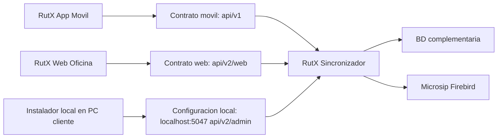
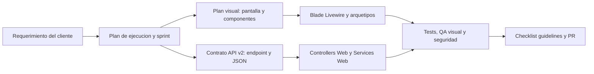

# Mapa Documental y Estándar de Trabajo — RutX Web

**Versión:** 1.2  
**Fecha:** 14 de agosto de 2026  
**Estado:** Norma de coordinación documental  
**Ámbito:** RutX Web, la API web del Sincronizador y sus puntos de integración. No modifica el contrato de la app móvil ni la configuración local del Sincronizador.  
**Documentos relacionados:** [`Plan_Estructura_Visual_Plataforma_Web_RutX.md`](Plan_Estructura_Visual_Plataforma_Web_RutX.md), [`guidelines.md`](guidelines.md), [`Contrato_API_Web_V2.md`](Contrato_API_Web_V2.md), [`Plan_Sprints_Semana_1.md`](Plan_Sprints_Semana_1.md) y `Plan_Ejecucion_Web_RutX.md`.

---

## 1. Propósito

Este documento evita que la información de RutX Web quede repartida en planes independientes o, peor aún, que dos documentos indiquen instrucciones distintas. Define **qué decide cada archivo**, cuándo debe consultarse y cuál prevalece cuando existe una diferencia.

> **Decisión de frontera:** RutX Web solo consume la familia **`/api/v2/web/*`**. La app móvil mantiene su contrato `/api/v1/*` y su login actual. El panel técnico local del Sincronizador, expuesto únicamente en `localhost:5047` bajo `/api/v2/admin/*`, es una herramienta de instalación e integración en la PC del cliente; no forma parte del portal administrativo, no se expone a red y no se modifica dentro del alcance web.

---

## 2. Mapa de componentes y límites

| Elemento | Responsabilidad | Puede comunicarse con | Prohibiciones |
|---|---|---|---|
| **RutX-AppMovil** | Operación offline del vendedor, descarga de paquete diario y envío de ventas/visitas. | Solo contrato móvil existente. | No consume endpoints de oficina ni expone datos de administración. |
| **RutX Web** | Presentación de oficina: dashboard, agenda, reportes, monitoreo, cancelaciones y notificaciones. | Solo `/api/v2/web/*`, desde `ApiClient` del servidor Laravel. | No abre Firebird, no llama `/api/v1/*`, no consulta `localhost:5047`, no guarda tokens en navegador. |
| **API Web v2** | Autenticación de oficina y casos de uso administrativos. | Servicios Web del Sincronizador, BD complementaria y servicios compartidos autorizados. | No devuelve DTOs móviles, no altera rutas v1 ni expone secretos de instalación. |
| **Configuración local** | Configurar, auditar e integrar el Sincronizador en la PC del cliente. | Solo launcher/administrador local y servicios del Sincro. | No se publica, no recibe CORS externo, no es backend de RutX Web. |
| **BD complementaria** | Proyecciones, agendas, trazas, notificaciones y usuarios de oficina según se apruebe su esquema. | Solo Sincronizador. | La web no se conecta directamente. |
| **Microsip** | Fuente maestra operativa. | Solo Sincronizador. | La web no lee ni escribe directamente. |

---

## 3. Jerarquía de documentos

| Orden de prevalencia | Archivo | Tipo de decisión | Cuándo se usa | Resultado esperado |
|---|---|---|---|---|
| 1 | **`guidelines.md`** | Reglas obligatorias de seguridad, estructura, consistencia y revisión. | Antes de escribir código y antes de abrir un PR. | Código seguro, mantenible y consistente. |
| 2 | **`Contrato_API_Web_V2.md`** | Frontera API, nomenclatura, JSON, permisos, endpoints y ownership de backend. | Antes de crear/consumir un endpoint. | Un contrato web independiente y verificable. |
| 3 | **`Plan_Estructura_Visual_Plataforma_Web_RutX.md`** | Layout, topbar, sidebar, navegación, paleta, cards, tablas y arquetipos. | Antes de crear o cambiar una pantalla/componente. | UI metálica uniforme, basada en el mock aprobado. |
| 4 | **`DesarrolloSeguroconLaravel12.md`** | Guía técnica de referencia: seguridad Laravel, API, diseño semántico, accesibilidad y calidad. | Para resolver una decisión técnica no detallada en los documentos 1–3. | Aplicación de las prácticas seguras nativas de Laravel. |
| 5 | **`Plan_Sprints_Semana_1.md`** | Secuencia de trabajo y entregables de una sola persona. | Para decidir qué construir hoy y qué queda diferido. | Alcance realista, verificable y sin sobreconstrucción. |
| 6 | **`Plan_Ejecucion_Web_RutX.md`** | Visión de producto, fases y relación con requerimientos del cliente/VeMobile. | Para priorizar roadmap y evitar perder el alcance de negocio. | Evolución alineada con el cliente. |
| 7 | **`Docs/CONTRATOS_WEB_V2.md`** en el repo Sincronizador | Especificación implementable endpoint por endpoint. | Durante el desarrollo .NET, pruebas y cambios de API. | Request, response, roles, errores y ejemplos exactos. |

Si dos documentos entran en conflicto, se resuelve en este orden. La excepción más importante es el modelo **API-first**: las secciones de migraciones, Eloquent y Sanctum local del documento `DesarrolloSeguroconLaravel12.md` son ejemplos generales de Laravel y **no se aplican a RutX Web**, porque el portal no administra una BD de negocio ni autentica contra una tabla local. Sí aplican sus principios de validación, CSRF, sesión segura, headers, rate limit, respuestas JSON, diseño, accesibilidad, Pint y pruebas.

---

## 4. Fuente única de verdad por activo

| Activo | Archivo fuente de verdad | Archivo técnico de implementación | Verificación |
|---|---|---|---|
| Paleta, tipografía, espaciado, radios y estados | `Plan_Estructura_Visual...` §3–4 y `DesarrolloSeguro...` §7 | `resources/css/tokens.css` y `resources/css/app.css` | Página de tokens + auditoría CI anti-hex. |
| Cards, etiquetas, tablas, filtros, modales y mapas | `Plan_Estructura_Visual...` §4 | `resources/views/components/` | Playground de componentes y tests de render. |
| Topbar, sidebar y mapa módulo → vista | `Plan_Estructura_Visual...` §2 | `config/navigation.php`, `<x-app-topbar>`, `<x-app-sidebar>` | Navegación de punta a punta sin enlaces cruzados. |
| Roles, sesión, secretos, validación y auditoría | `guidelines.md` §1; permisos de endpoint en `Contrato_API_Web_V2.md` §8.1 | Middleware, Form Requests, `ApiClient`, Policies/Livewire y `RequirePermission` en la API | Tests de autenticación/autorización y checklist PR. |
| JSON, rutas, DTOs y errores API | `Contrato_API_Web_V2.md` | `Controllers/Web`, `Models/Web`, `Services/Web`, `Docs/CONTRATOS_WEB_V2.md` | Tests de contrato y ejemplo request/response documentado. |
| Orden de trabajo y alcance de la semana | `Plan_Sprints_Semana_1.md` | Issues, ramas y commits | Criterio de cierre diario. |

---

## 5. Flujo obligatorio para una funcionalidad

Cada capacidad nueva —por ejemplo, el calendario Agenda o la cancelación de ventas— sigue el mismo flujo. No se inicia desde una vista aislada ni desde una consulta directa a la base de datos.

| Paso | Pregunta obligatoria | Documento que responde |
|---|---|---|
| 1. Prioridad | ¿El cliente lo pidió, VeMobile lo usa o es una mejora aprobada? | Plan de ejecución / sprint. |
| 2. Experiencia | ¿En qué módulo, vista y arquetipo vive? | Plan visual. |
| 3. Datos | ¿Qué endpoint web v2 lo atiende, qué roles necesita y qué JSON intercambia? | Contrato API web v2. |
| 4. Seguridad | ¿Qué valida Laravel, qué valida la API y qué se audita? | Guidelines y Desarrollo Seguro. |
| 5. Construcción | ¿Qué componente/servicio reutilizable se extiende en vez de clonar? | Plan visual y guidelines. |
| 6. Cierre | ¿Qué prueba, demo o criterio prueba que funciona? | Plan de sprints. |

---

## 6. Catálogo aprobado de API RutX Web

La siguiente nomenclatura es estable. Los endpoints se documentan detalladamente en `Contrato_API_Web_V2.md` y, al implementarse, en `RutX-Sincronizador/Docs/CONTRATOS_WEB_V2.md`.

| Familia | Alcance administrativo |
|---|---|
| `/api/v2/web/auth/*` | Login, identidad de oficina, renovación y cierre de sesión web. |
| `/api/v2/web/dashboard` | KPIs y series del tablero principal. |
| `/api/v2/web/agendas/*` | Calendario, vendedores por día, clientes asignados y movimientos batch. |
| `/api/v2/web/route-monitor/*` | Ruta activa, jornada, visitas, posiciones y última venta. |
| `/api/v2/web/sales/*` | Consulta/detalle de ventas y solicitudes de cancelación. |
| `/api/v2/web/reports/*` | Reportes consolidados, por ruta, piezas, montos y comparativas. |
| `/api/v2/web/customers/*` | Clientes, detalle y traspaso. |
| `/api/v2/web/inventory/*` | Inventario por ruta, rechazo y merma. |
| `/api/v2/web/notifications/*` | Emisión y bandeja de avisos de oficina a vendedor. |

---

## 7. Extensión futura: rol Contador

El rol `contador` es una previsión arquitectónica para clientes que contraten consulta financiera. **No es una función activa ni visible para Coyatoc**: en su MVP solo pueden emitirse `administrador`, `supervisor` y `lector`. Las restricciones, permisos y datos excluidos se definen conjuntamente en `guidelines.md` §1.3 y `Contrato_API_Web_V2.md` §8.1; el Plan Visual solo traduce esos permisos a navegación oculta y el sprint define cuándo implementar la infraestructura mínima. Ninguna pantalla, endpoint o exportación contable se agrega antes de que exista alcance comercial y política de datos aprobada.

---

## 8. Regla documental de cambios

Un cambio de comportamiento se realiza en esta secuencia: primero se actualiza el contrato o especificación afectada; después se actualiza el sprint si cambia alcance; finalmente se implementa. Un código que modifique un endpoint, prop de componente, color o regla de permiso sin actualizar su fuente de verdad se considera incompleto y no debe integrarse.

El encabezado de cada documento debe contener: **versión, fecha, estado, documentos relacionados y alcance**. Todo documento posterior debe incluir enlaces relativos a este mapa y a la fuente de verdad que lo gobierna.

---

*Este mapa es el punto de entrada para cualquier persona que se incorpore al desarrollo de RutX Web.*
