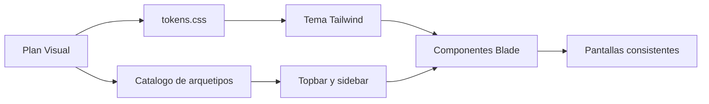
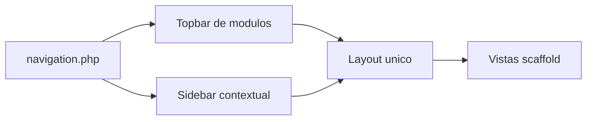
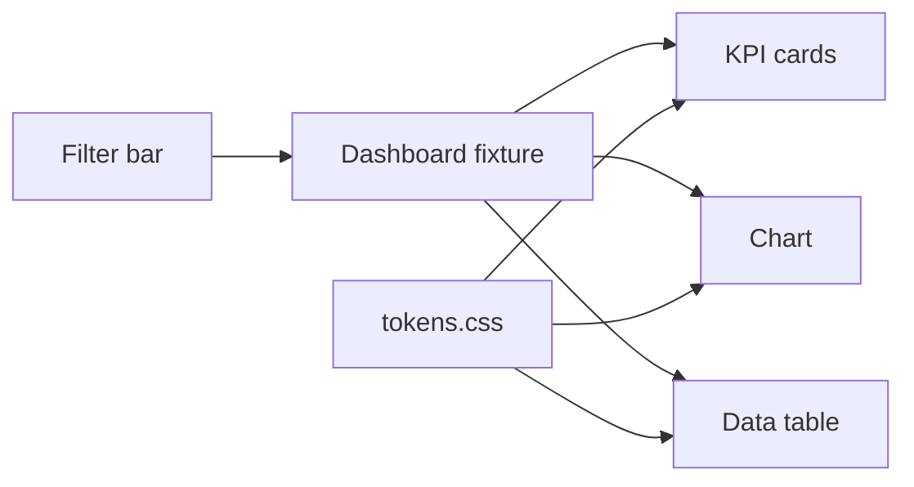
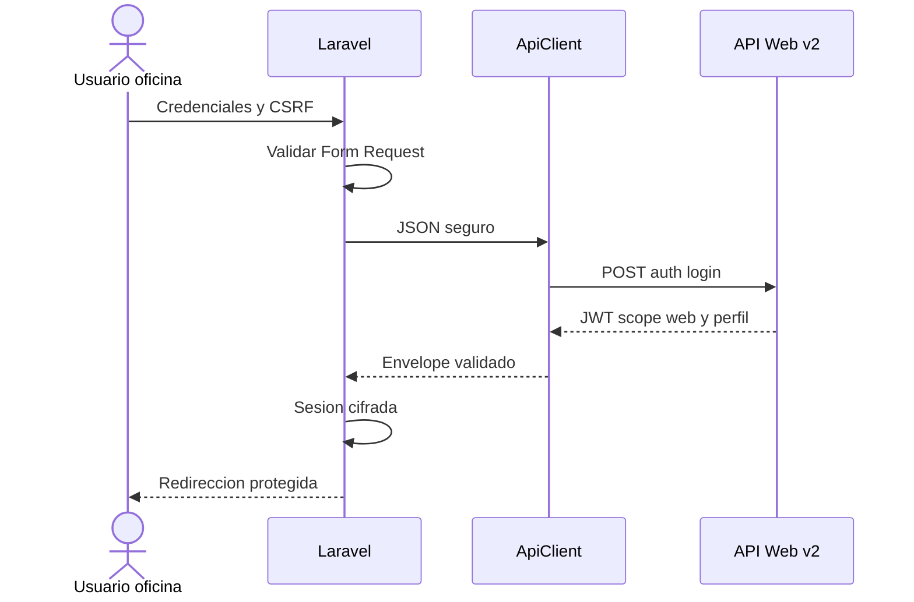
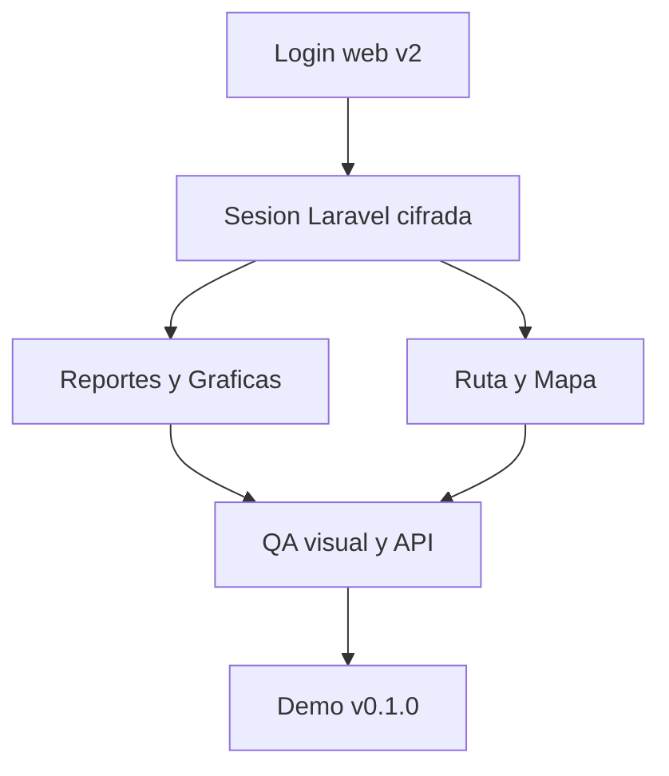

# Plan de Sprints — Fundación visual y primera integración de RutX Web

**Versión:** 3.1  
**Fecha de inicio:** jueves 13 de agosto de 2026  
**Fecha límite de esta entrega:** martes 18 de agosto de 2026  
**Capacidad:** un desarrollador; el alcance prioriza entregables demostrables y evita sobreconstrucción.  
**Estado:** plan de ejecución activo.  
**Ámbito:** Construcción inicial del portal RutX Web y primera frontera `/api/v2/web/*`; excluye API móvil y el administrador local `localhost:5047`.  
**Documentos relacionados:** [`Mapa_Documental_RutX_Web.md`](Mapa_Documental_RutX_Web.md), [`Plan_Estructura_Visual_Plataforma_Web_RutX.md`](Plan_Estructura_Visual_Plataforma_Web_RutX.md), [`guidelines.md`](guidelines.md) y [`Contrato_API_Web_V2.md`](Contrato_API_Web_V2.md).

## 0. Cómo usar este plan

Este es el **único documento que define el orden de trabajo diario**. No redefine reglas ni contratos: los consume de los documentos indicados en la siguiente tabla.

| Documento | Función en este sprint | Se usa para | Fuente de verdad |
|---|---|---|---|
| [`Mapa_Documental_RutX_Web.md`](Mapa_Documental_RutX_Web.md) | Índice de contexto y jerarquía. | Determinar qué documento debe cambiar junto con una tarea. | Relación documental. |
| [`Plan_Estructura_Visual_Plataforma_Web_RutX.md`](Plan_Estructura_Visual_Plataforma_Web_RutX.md) | Diseño aprobado de topbar, sidebar, paleta metálica, cards, tablas y arquetipos. | Construir la interfaz sin inventar estilos. | Visual y navegación. |
| [`guidelines.md`](guidelines.md) | Reglas de seguridad, JSON, calidad y estructura de código. | Implementar Laravel y consumir la API. | Seguridad y desarrollo. |
| [`Contrato_API_Web_V2.md`](Contrato_API_Web_V2.md) | Nomenclatura, endpoints, DTO, envelopes, permisos y auditoría. | Construir o consumir `/api/v2/web/*`. | Datos y contrato API. |
| `DesarrolloSeguroconLaravel12.md` | Base técnica de Laravel 12 y referencia del sistema visual. | Aplicar tokens, componentes nativos, validación, sesiones y headers. | Prácticas de base. |
| `Plan_Ejecucion_Web_RutX.md` | Roadmap funcional de producto. | Validar que el sprint mantenga el objetivo del cliente. | Alcance de negocio. |

> **Regla de cambio:** si una tarea modifica una decisión visual, de seguridad o de contrato, se actualiza la fuente de verdad correspondiente en el mismo pull request. El sprint solo registra la tarea y su evidencia de cierre.

---

## 1. Límites técnicos no negociables

| Área | Decisión acordada | Consecuencia para este sprint |
|---|---|---|
| Datos de negocio | Laravel no usa migraciones, Eloquent ni conexión directa a Firebird o a la BD complementaria. | La web consume APIs; no se crean tablas ni modelos de negocio en RutX Web. |
| API móvil | `/api/v1/*` y `POST /api/auth/login` son contratos de la app móvil. | No se alteran, no se consumen y no se documentan como rutas web. |
| API exclusiva de oficina | `/api/v2/web/*` es la frontera oficial de RutX Web. | Se construye primero su esqueleto y un flujo vertical mínimo. |
| Administrador local del Sincro | `localhost:5047/api/v2/admin/*` pertenece a la instalación/configuración técnica del Sincronizador. | **No se toca, no se expone y no se incluye** en `.env`, `ApiClient`, navegación ni demo web. |
| Autenticación web | Login propio de oficina con `POST /api/v2/web/auth/login`, JWT con `scope=web`, roles y zonas. | Laravel guarda el token exclusivamente en sesión cifrada del servidor. |
| Comunicación JSON | El navegador habla con Laravel; Laravel habla con el Sincronizador. | El navegador nunca recibe un JWT, nunca usa `localStorage` y no realiza `fetch` directo al Sincronizador. |
| Diseño | Componentes nativos Blade/Livewire, Vite y Tailwind 4. | Sin React, Vue, Bootstrap, Material ni librerías UI externas. |

### 1.1 Familias API aprobadas

```text
/api/v2/web/auth/*
/api/v2/web/dashboard
/api/v2/web/agendas/*
/api/v2/web/route-monitor/*
/api/v2/web/sales/*
/api/v2/web/reports/*
/api/v2/web/customers/*
/api/v2/web/inventory/*
/api/v2/web/notifications/*
```

> El alcance de esta semana es construir la **frontera v2**, el contrato base, el cliente seguro de Laravel y un flujo demostrable de autenticación/dashboard. Las demás familias se desarrollan por verticales en los sprints posteriores; registrar una familia no obliga a implementar todos sus endpoints en cinco días.

---

## 2. Resultado realista al martes 18

Al cierre habrá una base visual navegable, consistente con el mock RutX y VeMobile, y preparada para recibir la API web separada. La demo no pretende simular que ya se resolvieron reportes, monitoreo, cancelaciones o agendas reales: muestra la infraestructura correcta para construirlos sin deuda técnica.

| Entregable | Incluye | No incluye todavía |
|---|---|---|
| Sistema de diseño RutX | `tokens.css`, tipografía, etiquetas, cards, botones, tablas, estados, espaciado y documentación de uso. | Variantes no aprobadas ni estilos por pantalla. |
| Chasis de plataforma | Topbar de módulos, sidebar izquierdo contextual, layout único, breadcrumb, rutas y placeholders. | Pantallas de negocio completas fuera de Reportes y Gráficas. |
| Biblioteca de arquetipos | Data table, KPI card, filter bar, date range, status badge, modal, chart, moneda y estados. | Componentes duplicados o una biblioteca UI externa. |
| Frontera API v2 | Carpetas `Web/`, contrato canónico, envelopes JSON, `trace_id`, reglas de error y `ApiClient`. | Implementación de todas las familias API. |
| Vertical demostrable | Login web contra stub compatible y/o endpoint v2 disponible; pantalla Venta · Reportes y Gráficas con datos de fixture y misma interfaz que el endpoint. | Datos reales si el endpoint no está terminado; esos se conectan sin alterar Blade. |
| Seguridad básica verificable | Sesión cifrada, CSRF, headers, validación, TLS configurado, sin token expuesto y auditoría de dependencias. | Endurecimiento de producción completo y pentest, que pertenecen al piloto. |

---

## 3. Referencia funcional y de datos

### 3.1 Necesidades del cliente y pantalla objetivo

| Requerimiento del cliente | Módulo y vista RutX | Familia API futura | Referencia VeMobile |
|---|---|---|---|
| Supervisión de ruta, inicio, visitas y última venta. | Ruta · Mapa en tiempo real / Jornada. | `/route-monitor/*` | Mapa de Clientes y Ruta. |
| KPIs, ventas por ruta, piezas, montos, filtros y comparativas. | Venta · Reportes y Gráficas / Reportes Globales. | `/dashboard`, `/reports/*` | Dashboard, Utilidad, Reportes Globales. |
| Cancelar una venta desde oficina con motivo. | Venta · Pedidos / Visor. | `/sales/*` | Función que VeMobile no resuelve. |
| Créditos y cobranza. | Venta · Cobranza y Cliente. | `/sales/*`, `/customers/*` | Cobranza y Crédito. Fase 2. |
| Avisos de oficina hacia la app. | Notificaciones. | `/notifications/*` | Mejora de RutX sobre VeMobile. |
| Agenda: vendedores por día y clientes al desplegar cada vendedor. | Ruta · Agenda. | `/agendas/*` | Tablero semanal VeMobile, mejorado con franjas por vendedor. |

### 3.2 Lo que ya funciona y se respeta

| Componente existente | Papel actual | Uso desde RutX Web |
|---|---|---|
| App móvil Flutter | Opera offline; descarga clientes, ruta, precios y saldos; encola ventas, no-ventas y visitas. | No se modifica ni se le agregan llamadas web. |
| Sincronizador | Conecta la app con Microsip/Firebird y procesa sincronización. | Aloja la nueva API v2 web, aislada de controladores móviles. |
| Microsip | Fuente maestra de operación comercial. | Nunca se accede ni modifica directamente desde el portal. |
| BD complementaria | Sostiene ubicaciones, agendas, auditoría y proyecciones necesarias para la web. | El Sincronizador consulta/escribe; Laravel solo consume JSON. |
| Admin local `localhost:5047` | Configura o diagnostica el Sincronizador al instalarlo en la PC del cliente. | Fuera del portal y fuera del alcance de todos los sprints web. |

### 3.3 Agenda, principio funcional que guía su API

La Agenda administra **vendedor → día programado → clientes asignados**. La oficina opera el calendario en la web; el Sincronizador aplica esa agenda internamente cuando la app móvil pregunta qué clientes debe descargar ese día. Por ello el web consume `/api/v2/web/agendas/*`, mientras la aplicación conserva sus propios endpoints v1.

| Vista Ruta · Agenda | Comportamiento planeado | Contrato asociado |
|---|---|---|
| Filtros | Zona, Ruta y periodo Semana/Quincena/Mes; Ruta depende de Zona. | `GET /agendas` con filtros. |
| Tablero | Columnas por día, hoy destacado y contador de carga. | Respuesta semanal con `schedule_version`. |
| Franja de vendedor | Nombre, inicial/avatar y número de clientes. Clic despliega un acordeón nativo. | `GET /agendas/{fecha}/sellers/{vendedor_id}/customers`. |
| Clientes desplegados | Código, nombre, frecuencia de siete días y estatus. | `customers` dentro de la respuesta de detalle. |
| Movimiento masivo | Arrastrar, reasignar o quitar se guarda por lote. | `PATCH /agendas/assignments:batch` + `Idempotency-Key`. |

---

## 4. Sprints diarios — jueves 13 a martes 18

### Día 1 · Jueves 13 — Definición y asignación del sistema visual

**Propósito:** definir en archivos concretos la paleta, cards, etiquetas, tablas, topbar, sidebar y reglas de composición. Este día evita que la construcción posterior vuelva a decidir colores, tamaños o comportamientos.

| # | Acción | Archivo fuente de verdad | Resultado verificable |
|---|---|---|---|
| 1 | Cerrar la paleta metálica, estados y superficies. | `resources/css/tokens.css` y §3 del Plan Visual. | Tokens: `--rutx-primary`, `--rutx-primary-dark`, `--rutx-accent`, `--rutx-secondary`, `--rutx-bg`, `--rutx-surface`, texto, borde, sombras y estados. Ningún color vive en una vista. |
| 2 | Definir tipografía y escala. | `resources/css/tokens.css`. | Inter para interfaz, JetBrains Mono para montos/códigos; tamaños 12–32px, pesos 400/500/600/700, interlineado y espaciado establecidos. |
| 3 | Registrar arquetipos y sus responsabilidades. | §4 del Plan Visual; comentarios de props al inicio de cada componente futuro. | Lista cerrada: `<x-kpi-card>`, `<x-data-table>`, `<x-filter-bar>`, `<x-date-range>`, `<x-currency>`, `<x-status-badge>`, `<x-modal>`, `<x-chart>`, `<x-page-header>`, `<x-breadcrumb>`, `<x-app-topbar>`, `<x-app-sidebar>`, `<x-alert>`, `<x-loading-state>` y `<x-map-view>`. |
| 4 | Definir comportamiento de topbar y sidebar. | §2–2.3 del Plan Visual y `config/navigation.php` como próximo archivo. | Topbar = módulos; sidebar izquierdo = vistas del módulo activo; módulo activo con subrayado naranja; vista activa con borde izquierdo naranja. |
| 5 | Preparar calidad y seguridad desde el inicio. | `guidelines.md`; `.env.example`. | Se confirma que la web usará solo `API_WEB_*`, TLS, sesión cifrada, JSON y `ApiClient`; quedan excluidos `/api/v1/*` y `localhost:5047/api/v2/admin/*`. |
| 6 | Crear el mapa de entrega. | `Mapa_Documental_RutX_Web.md`. | Cada documento tiene propósito y referencia cruzada; no hay reglas duplicadas. |



**Cierre del día:** sistema visual documentado, fuentes de verdad ligadas y lista de archivos de construcción confirmada.  
**Commit sugerido:** `docs: define RutX visual system and document map`.

---

### Día 2 · Viernes 14 — Chasis Laravel y navegación contextual

**Propósito:** construir el layout único y el flujo de navegación que replica el mock aprobado: módulos en la parte superior y vistas contextuales a la izquierda.

| # | Acción | Implementación | Evidencia de cierre |
|---|---|---|---|
| 1 | Inicializar el repositorio privado `RutX-Web`. | Laravel 12, PHP 8.x, Vite y Tailwind 4; `.env.example` con `API_WEB_BASE_URL`, `API_WEB_TIMEOUT`, `API_WEB_CONNECT_TIMEOUT`, `API_WEB_AUTH_URL` y `API_WEB_VERIFY_TLS=true`. | Build base y configuración versionada sin secretos. |
| 2 | Aplicar el sistema visual. | `tokens.css` importado por `app.css`; fuentes locales empaquetadas, sin CDN. | Página de muestras con colores, tipografía y estados. |
| 3 | Montar `layouts/app.blade.php`. | Único chasis autenticado: topbar 64px, sidebar 256px y área de contenido. | Toda ruta autenticada renderiza el mismo layout. |
| 4 | Declarar navegación central. | `config/navigation.php` con Cliente, Producto, Inventario, Venta, Ruta y Configuración; cada módulo solo declara sus vistas. | Al cambiar de módulo, el sidebar cambia sin enlaces cruzados. |
| 5 | Construir `<x-app-topbar>` y `<x-app-sidebar>`. | Estado activo, íconos, colapso a 64px, tooltip, breadcrumb y placeholders. | El recorrido Cliente → Venta → Ruta → Configuración reproduce el modelo aprobado. |
| 6 | Configurar calidad. | Pint, prueba de build y regla de auditoría anti-hex fuera de `tokens.css`. | `npm run build` y Pint sin errores. |



**Cierre del día:** navegación completa con placeholders estándar y ningún estilo duplicado.  
**Commit sugerido:** `feat: add RutX application shell and contextual navigation`.

---

### Día 3 · Sábado 15 — Biblioteca de arquetipos y pantalla de referencia

**Propósito:** construir los componentes que todas las vistas de VeMobile/RutX comparten y usarlos en la primera pantalla de referencia, todavía con fixtures controlados.

| # | Acción | Implementación | Evidencia de cierre |
|---|---|---|---|
| 1 | Crear tablas y formatos de dato. | `<x-data-table>`, `<x-currency>`, `<x-status-badge>` y estado vacío; encabezado metálico, paginación y columnas de monto a la derecha. | Tabla de Movimientos con montos y piezas legibles. |
| 2 | Crear filtros uniformes. | `<x-filter-bar>` y `<x-date-range>` con presets Diario/Semanal/Mensual; barra reutilizable por reportes y agenda. | Los filtros se ven y se comportan igual en el playground. |
| 3 | Crear cards y estados. | `<x-kpi-card>`, `<x-alert>`, `<x-loading-state>` y reglas de etiqueta/ícono. | Siete KPI cards se renderizan solo con tokens. |
| 4 | Crear contenedores de visualización. | `<x-chart>`, `<x-modal>`, `<x-page-header>`, `<x-breadcrumb>`. Chart.js por npm/Vite. | Gráfica, diálogo y encabezado reutilizables. |
| 5 | Montar Venta · Reportes y Gráficas con fixture. | KPIs del mock, ventas por ruta y Movimientos; fixture con la misma forma de `DashboardResponse`. | Una pantalla completa sin lógica ni datos dentro de Blade. |
| 6 | Verificar el catálogo visual. | Ruta interna de playground temporal y capturas para la revisión. | Cada arquetipo tiene props documentadas y un caso de carga/vacío/error. |



**Cierre del día:** Venta · Reportes y Gráficas reproduce la composición del mock mediante arquetipos, no HTML repetido.  
**Commit sugerido:** `feat: add RutX visual component library and reports reference screen`.

---

### Día 4 · Domingo 16 — Reserva controlada y preparación de integración

**Propósito:** preservar una jornada de recuperación para una sola persona. No se compromete funcionalidad nueva; se usa únicamente si una tarea previa necesita cierre o para dejar lista la rama de integración v2.

| Prioridad | Acción permitida | Criterio |
|---|---|---|
| 1 | Corregir pendientes de Días 1–3. | Ningún componente queda incompleto antes de iniciar API. |
| 2 | Crear rama `feature/web-api-v2-foundation` en RutX-Sincronizador. | Sin cambios en controladores móviles ni en `AdminController`. |
| 3 | Copiar el contrato aprobado a `Docs/CONTRATOS_WEB_V2.md` del Sincronizador. | Contrato canónico en el backend y enlace desde el repositorio web. |
| 4 | Preparar lista de DTOs y endpoint vertical. | Alcance estricto: auth, identidad y dashboard; no se implementan agendas ni cancelaciones todavía. |

**Cierre del día:** descanso si no hay pendientes; si se usa, solo deja la integración preparada y compilando. No se amplía el alcance.  
**Commit sugerido si aplica:** `docs: seed canonical web v2 API contract`.

---

### Día 5 · Lunes 17 — Frontera segura de API web v2 y cliente Laravel

**Propósito:** construir el primer recorrido seguro de extremo a extremo sin tocar API móvil ni el administrador local: Laravel → `/api/v2/web/*` → envelope JSON → sesión cifrada → interfaz.

| # | Acción | Implementación | Evidencia de cierre |
|---|---|---|---|
| 1 | Separar físicamente la API web. | En RutX-Sincronizador: `Controllers/Web/`, `Models/Web/`, `Services/Web/` y `Docs/CONTRATOS_WEB_V2.md`. | Compilación sin mover ni reutilizar controladores `Movil/`. |
| 2 | Crear infraestructura v2. | Grupo `/api/v2/web`, middleware JWT `scope=web`, política de roles/zona, `trace_id`, envelope de éxito/error y manejo global de excepciones JSON. Registrar el catálogo de permisos, incluido `contador` como rol reservado y deshabilitado para Coyatoc. | Respuestas coherentes 200/401/403/422/500 sin stack trace; solo `administrador`, `supervisor` y `lector` pueden emitirse para Coyatoc. |
| 3 | Implementar el vertical de autenticación. | `POST /api/v2/web/auth/login`, `GET /api/v2/web/auth/me` y logout semántico; respuesta con usuario, roles y zonas permitidas. | JWT web independiente del login móvil; contrato y pruebas documentados. |
| 4 | Implementar lectura mínima de dashboard. | `GET /api/v2/web/dashboard` con filtros validados; puede devolver fixture server-side mientras se concluyen consultas de BD complementaria. | El JSON cumple `data`, `meta`, `trace_id`. |
| 5 | Construir `App\Services\ApiClient`. | `Http::baseUrl()->acceptJson()->asJson()->timeout()->connectTimeout()->withToken()`; TLS verificado; mapea envelopes y nunca expone token al navegador. | No existe `fetch`/Axios directo al Sincronizador. |
| 6 | Montar login Laravel seguro. | Form Request, CSRF, rate limit, token solo en sesión cifrada, middleware `auth.session`, invalidación al recibir 401. | Rutas protegidas sin token en HTML, cookie legible ni `localStorage`. |



**Cierre del día:** un usuario de oficina inicia sesión mediante la frontera v2; los errores devuelven JSON seguro y la UI solo muestra mensajes funcionales.  
**Commit sugerido:** `feat: add secure web v2 API foundation and Laravel client`.

---

### Día 6 · Martes 18 — Ensamble, QA, demo y cierre v0.1.0

**Propósito:** conectar la pantalla de referencia al contrato v2, validar todo el chasis y cerrar una demo honesta de lo construido.

| # | Acción | Implementación | Evidencia de cierre |
|---|---|---|---|
| 1 | Conectar dashboard. | Reemplazar el fixture local por `ApiClient->dashboard()` si `GET /dashboard` está disponible; si no, conservar el fixture con la misma interfaz y registrar el pendiente. | Blade no cambia al alternar fixture/API. |
| 2 | Crear el esqueleto Ruta · Mapa. | `<x-map-view>`, Leaflet por npm, tres marcadores de fixture y leyenda; sin afirmar monitoreo real todavía. | Módulo Ruta visible y consistente con topbar/sidebar. |
| 3 | Validar la frontera API. | Pruebas de auth, 401/403/422, envelope, `trace_id`, JSON inválido, TLS configurado e idempotencia documentada para futuros comandos. | Checklist de `guidelines.md` §1.5 cumplido. |
| 4 | Revisar calidad visual. | Auditoría de hex literales, contraste, foco, responsividad básica, estados vacío/carga/error, Pint y build. | No hay estilos inline ni componentes repetidos. |
| 5 | Cerrar privacidad mínima. | Footer de `/login` enlaza a `docs/aviso-privacidad.md`; sin cookies de terceros, pixels ni analytics. | Nota de privacidad visible y dependencias auditadas. |
| 6 | Registrar el siguiente vertical. | Preparar issues/ramas de Agenda, Cancelaciones, Reportes y Monitoreo según la tabla de sprints posteriores. | No se dejan tareas ambiguas. |
| 7 | Preparar demo. | Flujo: login → topbar → sidebar Venta → Reportes y Gráficas → Ruta · Mapa → logout. | Video corto y etiqueta `v0.1.0-foundation`. |



**Cierre del día:** demo navegable, contrato v2 base funcionando o sustituido transparentemente por fixture compatible, y backlog priorizado.  
**Commit sugerido:** `release: v0.1.0 RutX Web foundation`.

---

## 5. Controles de seguridad JSON que se revisan durante el sprint

| Control | Dónde se implementa | Día de verificación |
|---|---|---|
| HTTPS, TLS verificable y timeouts. | `.env.example`, configuración de `ApiClient`. | Día 2 y Día 5. |
| `Accept: application/json` y `Content-Type: application/json`. | Únicamente en `ApiClient`. | Día 5. |
| Validación de entradas. | Form Requests Laravel; DTOs y validadores del Sincronizador. | Día 5. |
| JWT fuera del navegador. | Sesión cifrada Laravel y middleware `auth.session`. | Día 5. |
| Envelope de éxito/error y `trace_id`. | Middleware/controladores bajo `Controllers/Web/`. | Día 5. |
| Idempotencia para comandos futuros. | Contrato; se activará con Agenda, Cancelación, Traspaso y Notificaciones. | Día 6 documental; Sprint 2 funcional. |
| Errores sin datos internos. | Manejo global del Sincronizador y mapeo de `ApiClient`. | Día 5 y QA Día 6. |
| CSRF y rate limiting del login. | Rutas Laravel y middleware. | Día 5. |

---

## 6. Siguientes sprints — implementación por verticales API

| Sprint | Objetivo de negocio | Familias API que se implementan | Vistas y componentes principales |
|---|---|---|---|
| **Sprint 2** | Agenda operativa y control de cancelaciones. | `/agendas/*`, `/sales/*` para detalle y cancelación. | Ruta · Agenda (calendario por día con vendedores desplegables), Pedidos, Visor, `<x-confirm-dialog>`. |
| **Sprint 3** | Reportería real y supervisión de ruta. | `/reports/*`, `/route-monitor/*`, expansión de `/dashboard`. | Reportes Globales, Rentabilidad, mapa en vivo, jornada y `<x-map-view>`. |
| **Sprint 4** | Catálogos de oficina, notificaciones y piloto. | `/customers/*`, `/inventory/*`, `/notifications/*`. | Clientes, Inventario por Ruta, emisión/bandeja de avisos, roles y zonas. Se mantiene `contador` reservado; solo se habilita con alcance contable formal para otro cliente o fase aprobada. |
| **Fase 2 cliente** | Crédito y cobranza administrativa. | Extensiones de `/sales/*` y `/customers/*` según contrato aprobado. | Cobranza, crédito por cliente, indicadores financieros. |

> Cada sprint implementa primero contrato + DTO + servicio + pruebas en el Sincronizador, después `ApiClient`, y al final Livewire/Blade. Así ninguna pantalla determina ad hoc la forma de los datos.

---

## 7. Checklist de cierre — martes 18

| # | Verificación |
|---|---|
| 1 | `tokens.css` es la única fuente de color, tipo, radios, sombras y estados; no hay hex literales fuera de ese archivo. |
| 2 | Topbar tiene los seis módulos; sidebar izquierdo muestra solo vistas del módulo activo; ambos leen `config/navigation.php`. |
| 3 | Las vistas scaffold existen y usan layout único, breadcrumb, estados de carga/vacío/error y componentes reutilizables. |
| 4 | La pantalla Venta · Reportes y Gráficas contiene KPIs, gráfica, filtros y tabla mediante arquetipos. |
| 5 | RutX Web no referencia `/api/v1/*`, `POST /api/auth/login` móvil ni `localhost:5047/api/v2/admin/*`. |
| 6 | La frontera v2 está separada en `Controllers/Web`, `Models/Web`, `Services/Web` y `Docs/CONTRATOS_WEB_V2.md`. |
| 7 | `ApiClient` es el único cliente HTTP; toda petición usa JSON, TLS, timeout y token desde sesión de servidor. |
| 8 | Login v2 usa validación, CSRF, rate limit, JWT `scope=web` y token no expuesto al navegador. |
| 9 | Éxitos y fallos API usan envelopes con `trace_id`; no se exponen SQL, trazas, tokens ni secretos. |
| 10 | `npm run build`, Laravel Pint y pruebas acordadas terminan correctamente. |
| 11 | `/login` incluye enlace a aviso de privacidad; no hay trackers, píxeles ni cookies de terceros. |
| 12 | Existe demo corta y versión `v0.1.0-foundation`; el backlog de Agenda/Cancelaciones/Monitoreo queda creado por vertical. |

---

*La regla de una sola persona: si una tarea se extiende, se conserva su definición de hecho y se mueve el siguiente vertical. No se recorta seguridad, el sistema visual ni la separación entre API web, móvil y administración local.*
